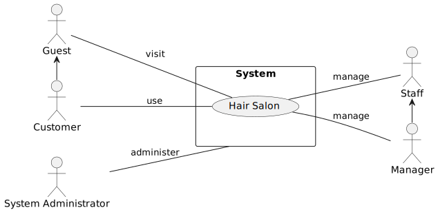
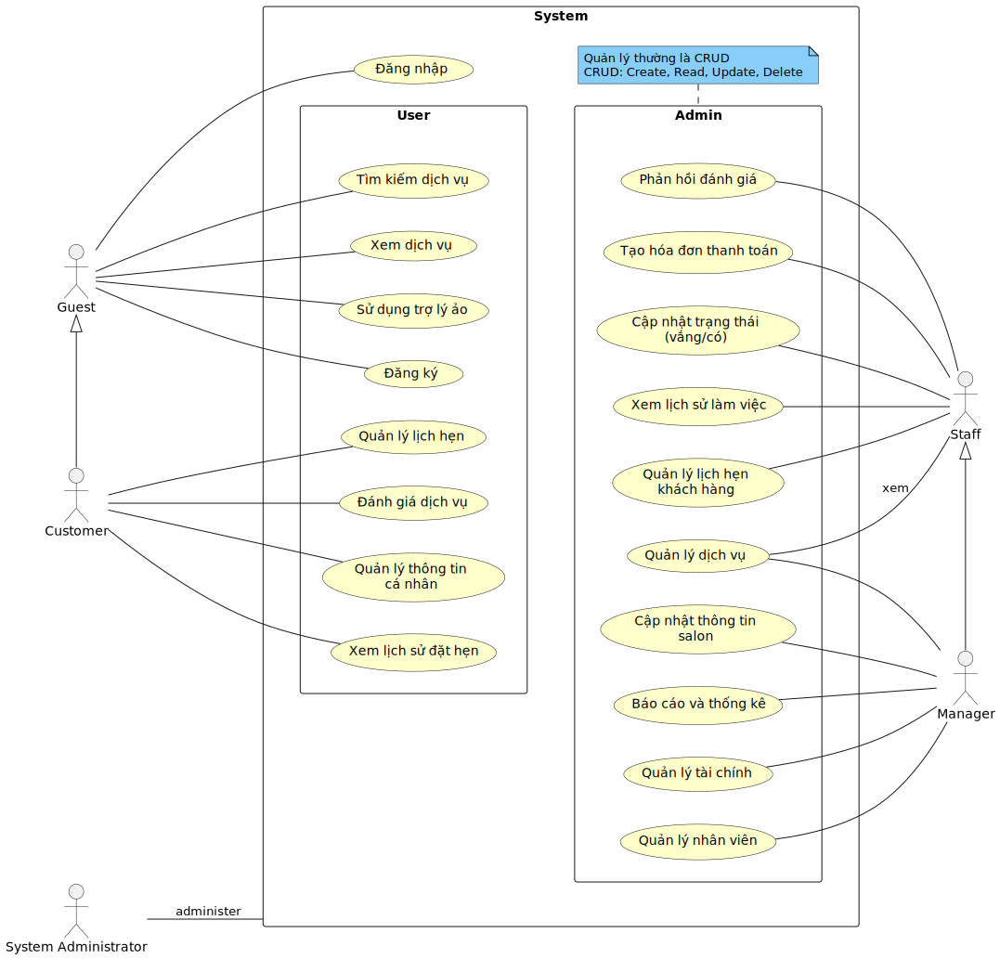

# Tài liệu đặc tả phần mềm

Hair Salon Booking App

Phiên bản: 1.0.0

Người soạn: Nguyễn Thanh Tân

## Giới thiệu

### Mục đích

Hair Salon Booking App là một website đặt lịch hẹn trực tuyến cho tiệm làm tóc. Thông qua website, khách hàng có thể tạo
tài khoản, xem thông tin về dịch vụ làm tóc cũng như đặt lịch hẹn trước khi đến tiệm.

Mục đích của tài liệu đặc tả yêu cầu phần mềm này là cung cấp một cái nhìn tổng quan, dễ hiểu về các yêu cầu, thành phần
của dự án.

### Phạm vi

Tài liệu đặc tả yêu cầu phần mềm này được xây dựng nhằm phục vụ cho dự án Hair Salon Booking App phục vụ việc đặt lịch
hẹn trực tuyến của khách hàng.

Ngoài ra, dự án còn cung cấp một hệ thống quản lý nhân sự cho tiệm để dễ dàng quản lý nhân viên, cũng như theo dõi các
chất lượng dịch vụ và lịch hẹn của khách hàng.

### Thuật ngữ và từ viết tắt

| Thuật ngữ | Viết tắt | Giải thích |
|-----------|----------|------------|

### Tổng quát

Tài liệu này được chia thành .. phần:

## Yêu cầu tương tác ngoài

### Giao diện người dùng

### Yêu cầu tương tác với phần cứng

### Yêu cầu tương tác với phần mềm

## Yêu cầu chức năng

### Các tác nhân

Các tác nhân tương tác với hệ thống gồm: Guest, Customer, Staff, Manager và System Administrator. Các đối tượng đó được
thể hiện trên sơ đồ sau:

### Các chức năng của hệ thống

1. Đăng nhập: Mục đích để xác thực người dùng khi tương tác với hệ thống nhằm cung cấp quyền và phạm vi truy cập hệ
   thống.
2. Đăng ký: Để truy cập sử dụng hệ thống, người dùng cần phải đăng ký tài khoản.
3. Quản lý lịch hẹn: Khách hàng có thể tạo lịch hẹn với nhân viên và chọn khung giờ thích hợp hoặc có thể thay đổi lịch
   hẹn hiện có. Nhân viên có thể chấp nhận hoặc từ chối lịch của khách hàng.
4. Khách hàng thân thiết: Tích điểm thưởng qua sử dụng dịch vụ và sử dụng điểm thưởng để khấu trừ các hóa đơn thanh
   toán.
5. Quản lý dịch vụ: Quản lý có thể thêm, xóa, sửa các dịch vụ cho tiệm.
6. Quản lý nhân viên: Quản lý có thể thêm, xóa, sửa nhân viên của tiệm.
7. Quản trị và giám sát hệ thống: Là công việc của Quản trị viên.

### Biểu đồ use case tổng quan

### Biểu đồ use case phân rã

#### Phân rã use case “Customer”

…

#### Phân rã use case “Staff”

…

#### Phân rã use case “Manager”

…

### Quy trình nghiệp vụ

#### Quy trình sử dụng phần mềm chung

…

#### Quy trình sử dụng phần mềm của “Customer”

…

#### Quy trình quản lý lịch hẹn khách hàng

…

#### Quy trình quản lý dịch vụ

…

#### Quy trình quản lý nhân viên

…

#### Quy trình thanh toán

…

## Yêu cầu phi chức năng

…

## Kiến trúc hệ thống

### Kiến trúc tổng thể

### Kiến trúc thành phần

## Các yêu cầu khác

## Phụ lục
