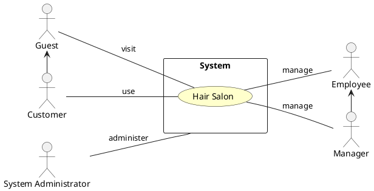
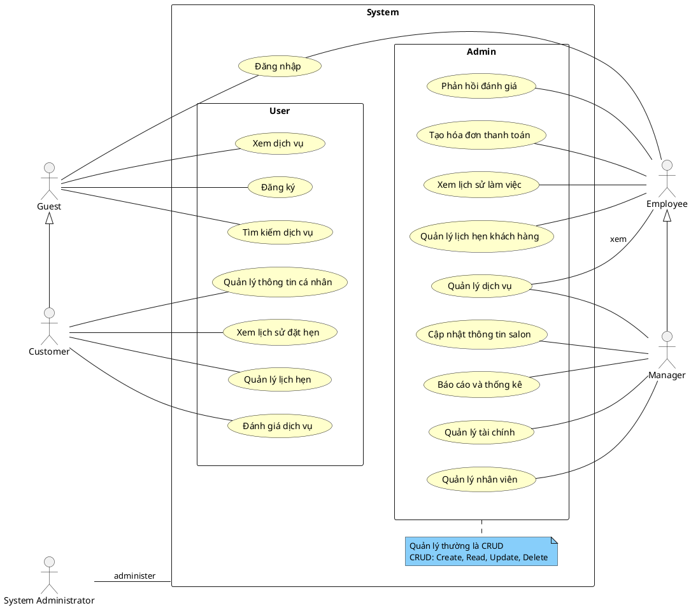
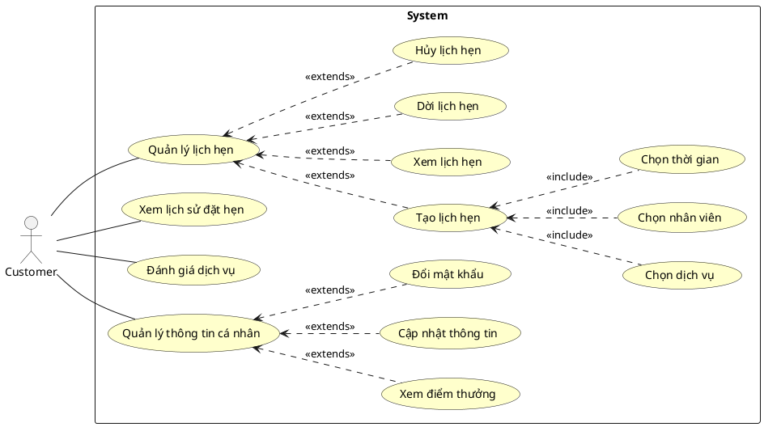
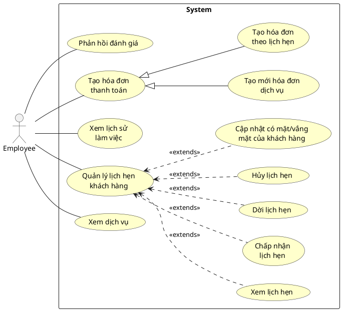
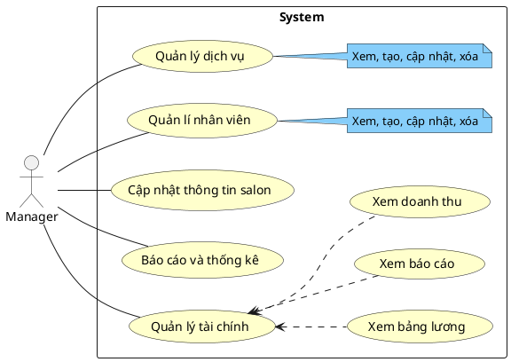
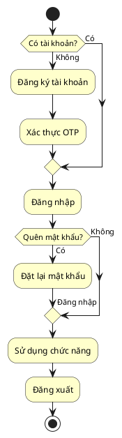
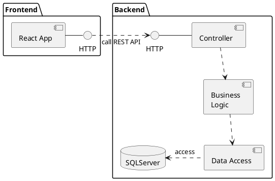
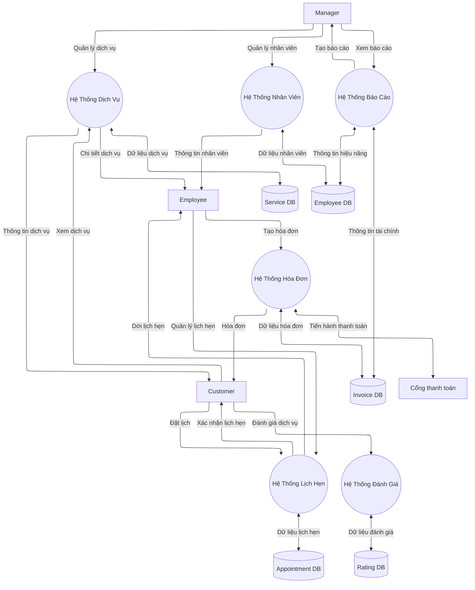
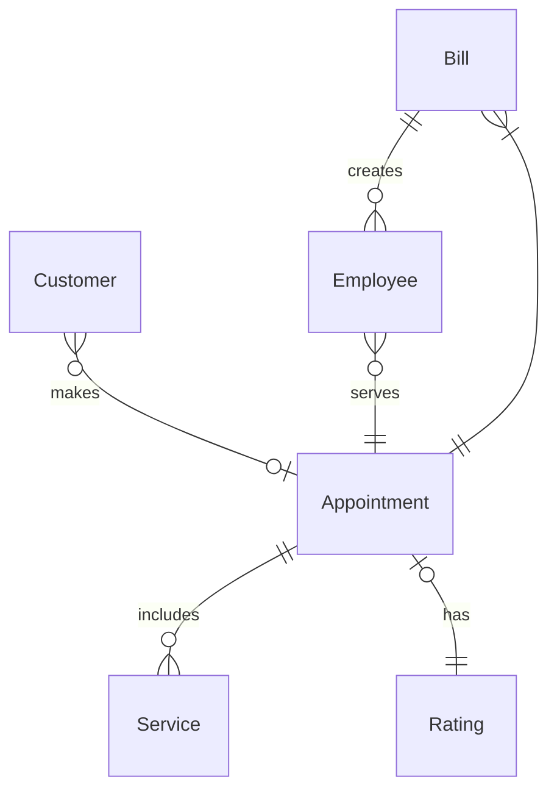

---
title: Tài liệu đặc tả phần mềm — virgo-14
subtitle: Hair Salon Booking
author: Nguyễn Thanh Tân
contributors:
  - Lê Hoàng Chiến
  - Nguyễn Huỳnh Sang
  - Võ Hồ Hoàng Hà
  - Đoàn Thị Yến
  - Đặng Huỳnh Trà My
  - Trần Đặng Mỹ Duyên
subject: Software Specifications
date: 22/10/2024
lang: vi
fontsize: 12pt
titlepage: true
titlepage-rule-color: "360049"
titlepage-background: "backgrounds/title-page.pdf"
toc: true
toc-own-page: true
toc-depth: 3
caption-justification: centering
numbersections: true
footer-left: "\\hspace{1cm}"
---

\renewcommand{\listfigurename}{Danh mục hình ảnh}
\listoffigures
\addcontentsline{toc}{section}{\listfigurename}

\newpage

\section*{Thông tin tài liệu}
\addcontentsline{toc}{section}{Thông tin tài liệu}

- **Tên dự án:** Hair Salon
- **Mã dự án:** virgo-14
- **Phiên bản:** 1.0 draft 2
- **Ngày hoàn thành:** 22/10/2024
- **Người soạn:** Nguyễn Thanh Tân
- **Người đóng góp:**
    - Lê Hoàng Chiến
    - Nguyễn Huỳnh Sang
    - Võ Hồ Hoàng Hà
    - Đoàn Thị Yến
    - Đặng Huỳnh Trà My
    - Trần Đặng Mỹ Duyên

\newpage

## Giới thiệu

### Mục đích

Dự án **Hair Salon Booking** là một website đặt lịch hẹn trực tuyến cho tiệm làm tóc. Website cho phép khách hàng tìm
kiếm dịch vụ, xem thông tin dịch vụ, quản lý thông tin cá nhân và giúp quản lý salon dễ dàng.

Mục đích của tài liệu đặc tả phần mềm này là cung cấp một cái nhìn tổng quan, dễ hiểu về các yêu cầu, thành phần, kiến
trúc của dự án.

### Phạm vi

Dự án **Hair Salon Booking** phục vụ việc đặt lịch hẹn trực tuyến cho các dịch vụ trực tuyến của tiệm. Website sẽ kết
nối các khách hàng với các nhân viên làm việc trong tiệm. Nhân viên có thể theo dõi, chấp nhận từ chối các lịch hẹn mà
khách hàng đã đặt.

Ngoài ra, website còn tích hợp thanh toán bằng mã QR, tạo và lưu hóa đơn cho khách đến sử dụng dịch vụ không thông qua
website. Từ đó, nâng cao trải nghiệm sử dụng dịch vụ của khách hàng và quản lý có thể giám sát, theo dõi, thông kê các
hoạt động của tiệm.

### Thuật ngữ

| Thuật ngữ            | Viết tắt | Giải thích                                                     |
|----------------------|----------|----------------------------------------------------------------|
| Guest                |          | Những người sử dụng hệ thống chưa đăng ký/đăng nhập tài khoản. |
| Customer             |          | Khách hàng sử dụng dịch vụ của tiệm.                           |
| Employee             |          | Nhân viên phục của cửa tiệm.                                   |
| Manager              |          | Nhân viên quản lý hoặc chủ cửa tiệm.                           |
| System Administrator |          | Nhân viên giám sát, hỗ trợ kĩ thuật về hạ tầng hệ thống.       |        

## Yêu cầu chức năng

### Các tác nhân

Các tác nhân tương tác với hệ thống gồm: Guest, Customer, Employee, Manager và System Administrator. Các đối tượng đó
được thể hiện trên sơ đồ sau:

### Các chức năng của hệ thống

1. Đăng nhập/Đăng ký: Mục đích để xác thực và phân quyền truy cập vào hệ thống.
2. Quản lý lịch hẹn: Khách hàng có thể tạo lịch hẹn với nhân viên và chọn khung giờ thích hợp hoặc có thể thay đổi lịch
   hẹn hiện có. Nhân viên có thể chấp nhận hoặc từ chối lịch của khách hàng.
3. Khách hàng thân thiết: Tích điểm thưởng qua sử dụng dịch vụ và sử dụng điểm thưởng để khấu trừ các hóa đơn thanh
   toán.
4. Quản lý dịch vụ: Quản lý có thể thêm, xóa, sửa các dịch vụ cho tiệm.
5. Quản lý nhân viên: Quản lý có thể thêm, xóa, sửa nhân viên của tiệm.
6. Quản lý hóa đơn: Nhân viên có thể tạo các hóa đơn sử dụng dịch vụ cho khách hàng, các hóa đơn sẽ được lưu trữ để
   thống kê, báo cáo.
7. Quản trị và giám sát hệ thống: Là công việc của Quản trị viên.

### Biểu đồ use case tổng quan

### Biểu đồ use case phân rã

#### Phân rã use case “Customer”

#### Phân rã use case “Employee”

#### Phân rã use case “Manager”

### Quy trình nghiệp vụ

#### Quy trình sử dụng phần mềm chung

Guest cần đăng nhập để sử dụng các chức năng của hệ thống. Nếu chưa có tài khoản Guest bắt buộc phải đăng ký. Nếu quên
mật khẩu, hệ thống sẽ cho phép cấp lại mật khẩu thông qua email đã đăng ký.

Sau khi đăng nhập thành công vào hệ thống, Customer có thể sử dụng các chức năng như Quản lý thông tin, Quản lý đặt lịch
hẹn, và các chức năng trong phạm vi của mình mà hệ thống đã cấp phát.

Đối với Employee, các tài khoản phải được cung cấp bởi Manager, Employee không thể tự đăng ký tài khoản. Nếu đăng nhập
lần đầu, hệ thống sẽ yêu cầu tạo một mật khẩu mới để thay mật khẩu được cấp. Employee cũng có thể sử dụng hệ hệ thống
dành cho nhân viên trong thuộc các quyền hạn được cấp.

#### Quy trình sử dụng phần mềm của “Customer”

#### Quy trình quản lý lịch hẹn

Khách hàng chọn các chức năng: đặt lịch, xem lịch, hủy lịch và thay đổi lịch hẹn. Hệ thống sẽ phản hồi lại từng yêu cầu:
lưu thông tin lịch hẹn, hiển thị lịch hẹn chi tiết, cập nhật lịch hẹn đã hủy, kiểm tra lịch hẹn trùng lịch. Khi xác nhận
thành công sẽ gửi thông báo về cho khách hàng.

#### Quy trình quản lý lịch hẹn khách hàng

#### Quy trình quản lý dịch vụ

#### Quy trình quản lý nhân viên

## Yêu cầu phi chức năng

1. **Tính khả dụng**

    - Hệ thống cần đạt tỷ lệ hoạt động ít nhất 99,5% trong năm.
    - Thời gian khôi phục hệ thống sau khi xảy ra sự cố không quá 2 giờ.

2. **Tính bảo mật**

    - Hệ thống cần đáp ứng các tiêu chuẩn an ninh thông tin phổ biến như OWASP.
    - Các tài khoản người dùng phải được bảo vệ bằng mật khẩu mạnh và có cơ chế xác thực 2 yếu tố.
    - Dữ liệu của khách hàng và giao dịch thanh toán phải được mã hóa và bảo vệ nghiêm ngặt.

3. **Tính di động**

    - Giao diện người dùng phải được thiết kế responsive, có thể truy cập tốt trên các thiết bị di động như điện thoại
      và
      máy tính bảng.
    - Ứng dụng di động cho phép nhân viên quản lý lịch hẹn và thông tin khách hàng trên thiết bị di động.

4. **Khả năng mở rộng**

    - Hệ thống cần có khả năng mở rộng để phục vụ từ 5 đến 50 nhân viên và hàng trăm khách hàng.
    - Cơ sở dữ liệu phải có thiết kế sẵn sàng cho việc mở rộng quy mô.

5. **Hiệu suất**

    - Thời gian phản hồi của hệ thống trong các tác vụ quan trọng như đặt lịch hẹn, thanh toán không quá 3 giây.
    - Hệ thống phải có khả năng xử lý ít nhất 50 giao dịch đặt lịch hẹn đồng thời.

6. **Khả năng tích hợp**

    - Hệ thống cần tích hợp với cổng thanh toán trực tuyến phổ biến như VNPay, MoMo.
    - Cần có giao diện API để có thể tích hợp với các hệ thống khác trong tương lai.

7. **Độ tin cậy**

    - Hệ thống phải có cơ chế sao lưu dữ liệu và khôi phục dữ liệu trong trường hợp sự cố, đảm bảo không mất dữ liệu.
    - Hệ thống cần có chức năng theo dõi và cảnh báo các lỗi, sự cố phát sinh.

## Kiến trúc hệ thống

### Kiến trúc tổng thể

### Luồng dữ liêu của hệ thống

### Quan hệ các thực thể

