---
title: Tài liệu đặc tả phần mềm — virgo-14
subtitle: Hair Salon Booking
author: Nguyễn Thanh Tân
contributors:
  - Lê Hoàng Chiến
  - Nguyễn Huỳnh Sang
  - Võ Hồ Hoàng Hà
  - Đoàn Thị Yến
  - Đặng Huỳnh Trà My
  - Trần Đặng Mỹ Duyên
subject: Software Specifications
lang: vi
fontsize: 12pt
titlepage: true
titlepage-rule-color: "360049"
titlepage-background: "backgrounds/title-page.pdf"
toc: true
toc-own-page: true
toc-depth: 3
numbersections: true
footer-left: "\\hspace{1cm}"
---

\renewcommand{\listfigurename}{Danh mục hình ảnh}
\listoffigures
\addcontentsline{toc}{section}{\listfigurename}

\newpage

# Tài liệu đặc tả phần mềm

<table>
    <tr>
        <th>Tên dự án</th>
        <td>Hair Salon Booking</td>
    </tr>
    <tr>
        <th>Mã dự án</th>
        <td>virgo-14</td>
    </tr>
    <tr>
        <th>Phiên bản</th>
        <td>1.0 (draft)</td>
    </tr>
    <tr>
        <th>Người soạn</th>
        <td>Nguyễn Thanh Tân</td>
    </tr>
    <tr>
        <th>Người đóng góp</th>
        <td>
            Lê Hoàng Chiến 
            Nguyễn Huỳnh Sang 
            Võ Hồ Hoàng Hà 
            Đoàn Thị Yến 
            Đặng Huỳnh Trà My 
            Trần Đặng Mỹ Duyên
        </td>
    </tr>
</table>

## Giới thiệu

### Mục đích

Dự án **Hair Salon Booking** là một website đặt lịch hẹn trực tuyến cho tiệm làm tóc. Website cho phép khách hàng tìm
kiếm dịch vụ, xem thông tin dịch vụ, quản lý thông tin cá nhân và giúp quản lý salon dễ dàng.

Mục đích của tài liệu đặc tả phần mềm này là cung cấp một cái nhìn tổng quan, dễ hiểu về các yêu cầu, thành phần, kiến
trúc của dự án.

### Phạm vi

Dự án **Hair Salon Booking** phục vụ việc đặt lịch hẹn trực tuyến cho các dịch vụ trực tuyến của tiệm. Website sẽ kết
nối các khách hàng với các nhân viên làm việc trong tiệm. Nhân viên có thể theo dõi, chấp nhận từ chối các lịch hẹn mà
khách hàng đã đặt.

Ngoài ra, website còn tích hợp thanh toán bằng mã QR, tạo và lưu hóa đơn cho khách đến sử dụng dịch
vụ không thông qua website. Từ đó, nâng cao trải nghiệm sử dụng dịch vụ của khách hàng và quản lý có thể giám sát, theo
dõi, thông kê các hoạt động của tiệm.

## Yêu cầu chức năng

### Các tác nhân

Các tác nhân tương tác với hệ thống gồm: Guest, Customer, Staff, Manager và System Administrator. Các đối tượng đó được
thể hiện trên sơ đồ sau:

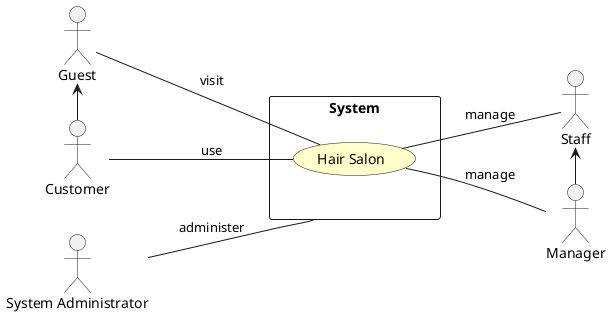

### Các chức năng của hệ thống

1. Đăng nhập: Mục đích để xác thực người dùng khi tương tác với hệ thống nhằm cung cấp quyền và phạm vi truy cập hệ
   thống.
2. Đăng ký: Để truy cập sử dụng hệ thống, người dùng cần phải đăng ký tài khoản.
3. Quản lý lịch hẹn: Khách hàng có thể tạo lịch hẹn với nhân viên và chọn khung giờ thích hợp hoặc có thể thay đổi lịch
   hẹn hiện có. Nhân viên có thể chấp nhận hoặc từ chối lịch của khách hàng.
4. Khách hàng thân thiết: Tích điểm thưởng qua sử dụng dịch vụ và sử dụng điểm thưởng để khấu trừ các hóa đơn thanh
   toán.
5. Quản lý dịch vụ: Quản lý có thể thêm, xóa, sửa các dịch vụ cho tiệm.
6. Quản lý nhân viên: Quản lý có thể thêm, xóa, sửa nhân viên của tiệm.
7. Quản trị và giám sát hệ thống: Là công việc của Quản trị viên.

### Biểu đồ use case tổng quan

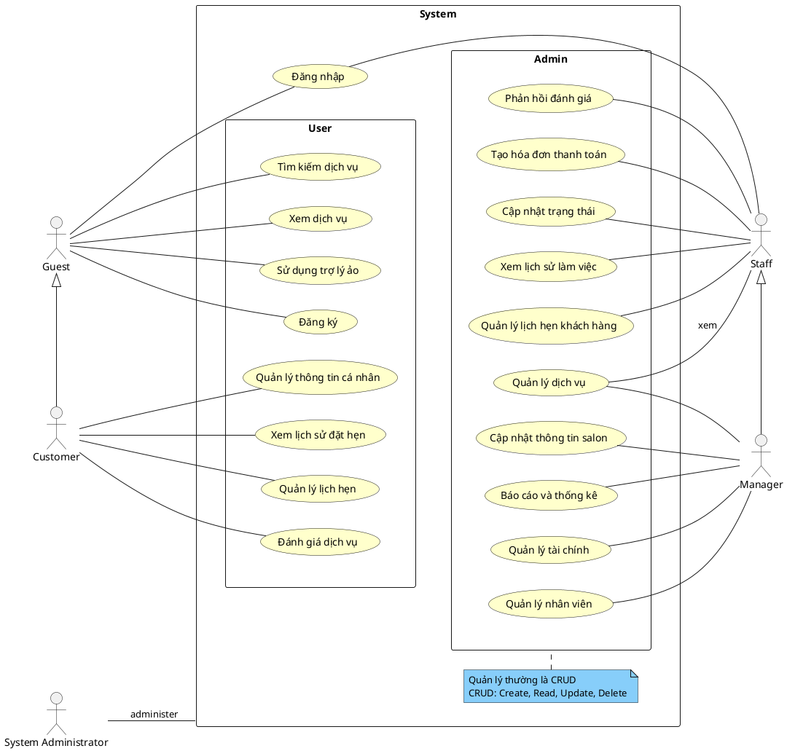

### Biểu đồ use case phân rã

#### Phân rã use case “Customer”

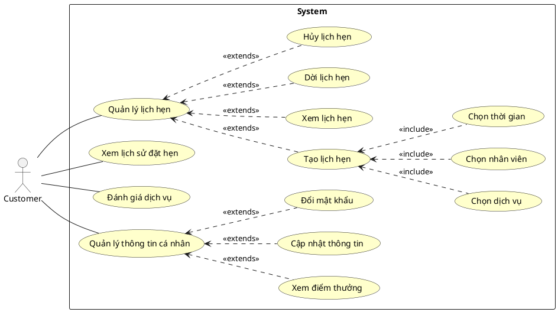

#### Phân rã use case “Staff”

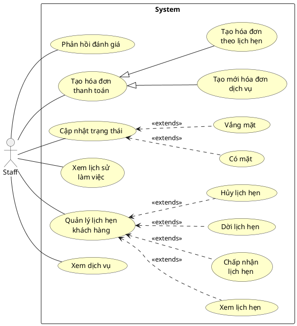

#### Phân rã use case “Manager”

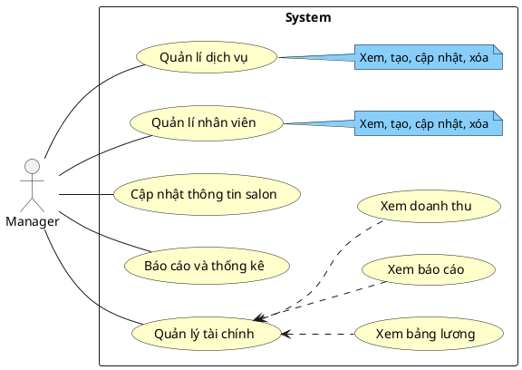

### Quy trình nghiệp vụ

#### Quy trình sử dụng phần mềm chung

#### Phía khách hàng

Guest có thể đăng ký để tạo ra tài khoản cho mình. Sau đó có thể đăng nhập để sử dụng
các chức năng của phần mềm. Nếu Guest quên mật khẩu, khách có thể yêu cầu hệ thống
cho phép mình thiết lập lại mật khẩu. Lúc này, Guest sẽ nhập OTP được gửi qua SĐT đã đăng ký.

Sau khi đăng nhập thành công vào hệ thống, Customer có thể sử dụng các chức năng như Quản lý thông tin, Quản lý đặt lịch
hẹn, và các chức năng trong phạm vi của mình mà hệ thống đã cấp phát.

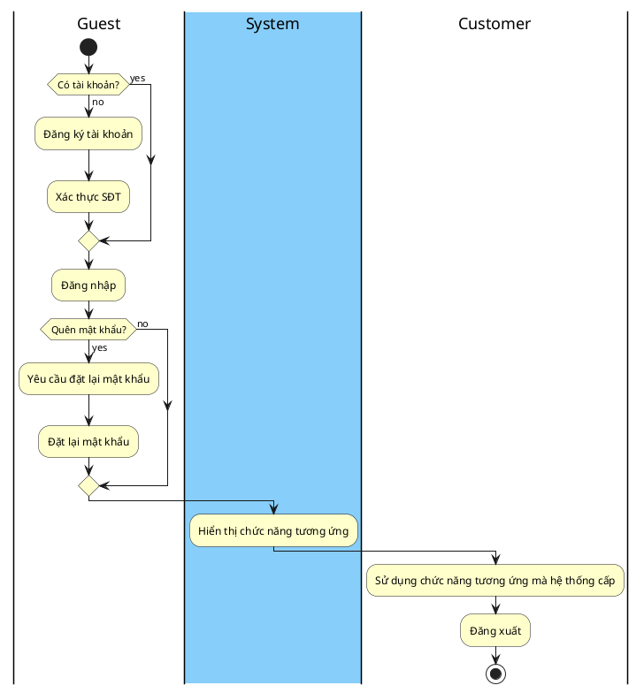

#### Phía nhân viên

Guest cần đăng nhập để có thể sử dụng hệ thống. Trong trường hợp quên mật khẩu, Guest có thể gửi yêu cầu đặt lại mật
khẩu. Nếu đăng nhập lần đầu, hệ thống sẽ yêu cầu Staff tạo một mật khẩu mới để thay mật khẩu được cấp.

Các tài khoản Staff phải được cung cấp bởi Manager, Staff không thể đăng ký tài khoản.

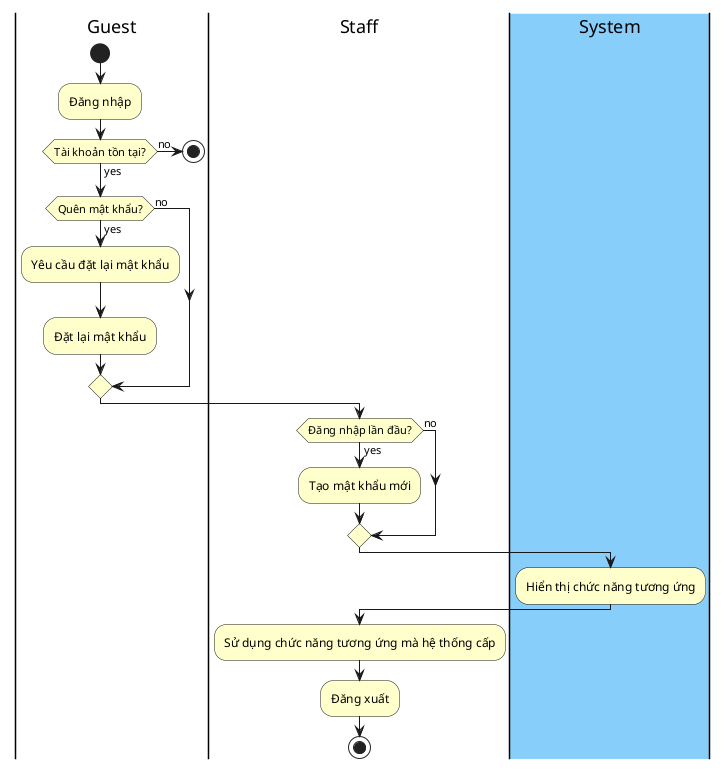

#### Quy trình sử dụng phần mềm của “Customer”

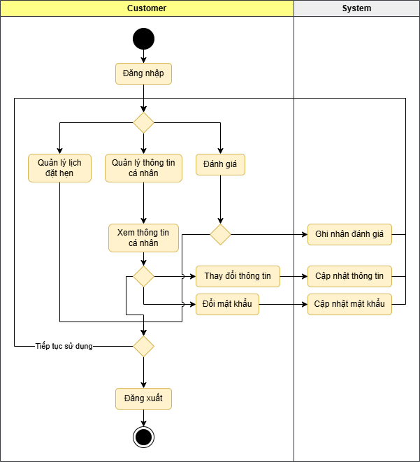

#### Quy trình quản lý lịch hẹn

Khách hàng chọn các chức năng: đặt lịch, xem lịch, hủy lịch và thay đổi lịch hẹn. Hệ thống sẽ phản hồi lại từng yêu cầu:
lưu thông tin lịch hẹn, hiển thị lịch hẹn chi tiết, cập nhật lịch hẹn đã hủy, kiểm tra lịch hẹn trùng lịch. Khi xác nhận
thành công sẽ gửi thông báo về cho khách hàng.

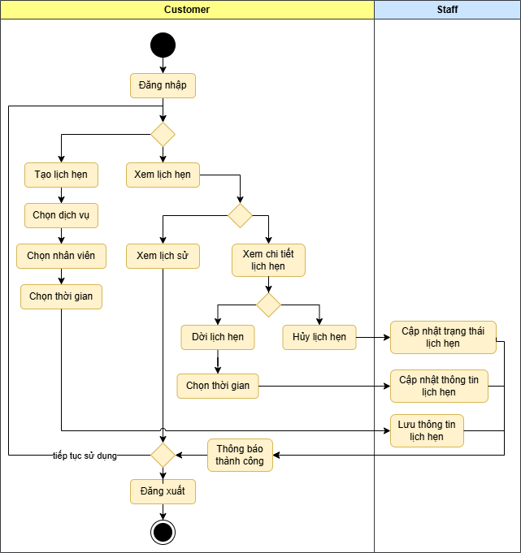

#### Quy trình quản lý lịch hẹn khách hàng

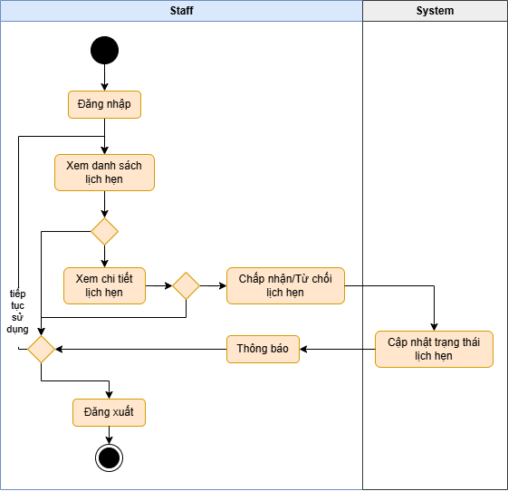

#### Quy trình quản lý dịch vụ

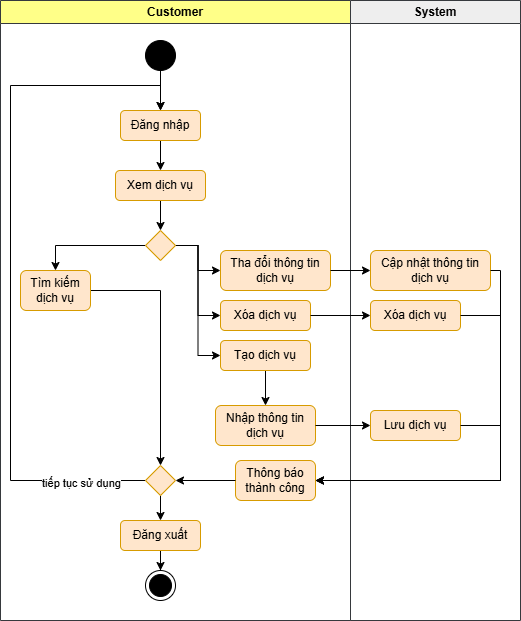

#### Quy trình quản lý nhân viên

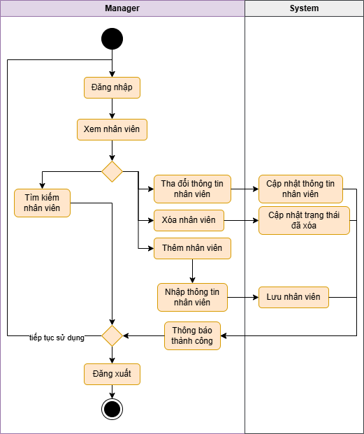

#### Quy trình thanh toán

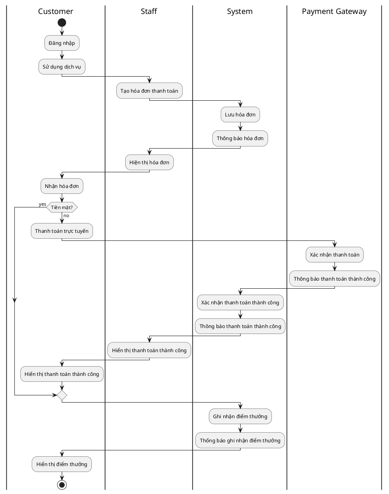

## Phụ lục
